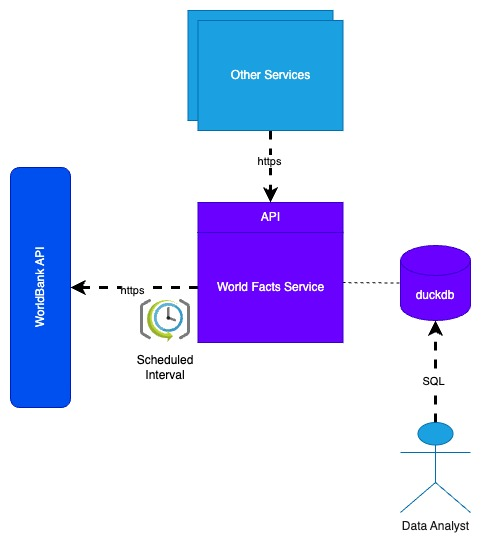

# Data Engineer: World Bank DataFeed Assessment

## Introduction

You have been tasked to create a `World Facts Service` that has the responsibility of data sourcing via an internal feed
capability, and data serving via its database tables.

The service will be used by analysts via its database. Our analysts need access to a database with world facts, so they can ensure our fund offerings better reflect the global economy.

The service additionally hosts an API to initiate the data feed that can be called by other services. 

The solution design is depicted in the following diagram.

## Principles

The principles for completing this assignment are as follows:

1. Modify / add / remove any file in this repository to achieve the requirements. E.g. You may replace this `README.md`
   and any files in this project as you see fit to achieve the set requirements.

2. Ensure you build this service and code base such that it would be ready for production by raising a pull request to
   merge and deploy.
3. Provide instructions on how to ensure steps and processes are repeatable and reproducible.
4. Highlight any assumptions you make in your implementation as you go.
5. You may assume that we have the following in place in production:
   - An active internet connection
   - a Python 3.11+ installation
   - a duckdb installation

## Requirements

This assignment is broken down into modules, each with its own requirements. You are expected to complete as many as
possible within the time allotted.

The service is started by running [main.py](./main.py) as the entry point.

### Module 1: Data Sourcing

In this module you will start the work on the `World Facts Service` to source data that will be stored in a duckdb database.

Using the [World Bank API](https://datahelpdesk.worldbank.org/knowledgebase/topics/125589), build the service to source and populate a duckdb database with:

1. The list of countries
2. Total population of each country
3. Total GDP of each country
4. Number of exporters

### Module 2: Data Reporting

Provide a mechanism in your service that uses the data in the database retrieved in Module 1 to produce two reports

1. Top 10 countries by GDP per capita
2. Total GDP per region

### Module 3: Data Refresh

Ensure the data source can be run on a configured schedule to ensure data is kept fresh.

### Module 4: Refresh API

Ensure we can trigger the data refresh via an API endpoint.

## Project Overview
This project consists of a data fetching and reporting application that interacts with the World Bank API to retrieve economic data (e.g., GDP, exports, population) for various countries. The application is structured into a scheduler, a web API, and data processing modules, allowing for both periodic data updates and on-demand reporting.

## Components
## Scheduler (main.py):
Responsible for periodically refreshing data and generating reports.
Utilizes the schedule library to run tasks every 120 minutes.
Can also execute tasks on command line arguments: refresh or report.  
example:
 python main.py refresh (for refresh )
 python main.py report(for reports)

# Web API (app.py):
Built using Flask, this API allows users to retrieve specific economic data via HTTP GET requests.
CORS is enabled for cross-origin resource sharing.
 
Routes:
/<input_parameter>: Returns data based on input parameters (countries, GDP, exports, population,Refresh to refresh the data ).

## Data Processing (module1.py):
Fetches data from the World Bank API and processes it into a structured format.
Data is stored in a DuckDB database for efficient querying.
Functions to retrieve country codes and load JSON data for specified indicators.

## Reporting (reports/report.py):
DuckDB Connection:
Connects to a DuckDB database  to query economic metrics.

Functions:
top_10_gdp_per_capita(con): Retrieves the top 10 countries by GDP per capita.
total_gdp_per_country(con): Calculates the total GDP for each country.
report_main(input_parameter=None): Main function that orchestrates the report generation by calling the other functions.

## Setup Instructions:
Requirements:

Python 3.x
Required libraries:
pip install pandas requests flask flask-cors duckdb schedule
Directory Structure:

/project_root
├── src
│   ├── module1.py
├── reports
│   ├── report.py
├── main.py
├── app.py
├── data.py
Running the Application:

## Start the scheduler in one terminal:

python main.py
Start the Flask web server in another terminal:

python app.py

# Access the API by navigating to:

http://127.0.0.1:5000/
API Usage:

# To get country data:
http://127.0.0.1:5000/countries

# To get GDP data:
http://127.0.0.1:5000/GDP

# To get exports data:
http://127.0.0.1:5000/exports

# To get population data:
http://127.0.0.1:5000/population

Notes
The application can be extended to add more features such as user authentication, advanced reporting capabilities, and front-end visualization.
Remember to set debug=False in app.py when deploying in a production environment.
Troubleshooting
Ensure that all required packages are installed.
If you encounter errors while fetching data from the API, check the network connection and the API endpoint availability.
Use logging statements in the code to help diagnose issues.